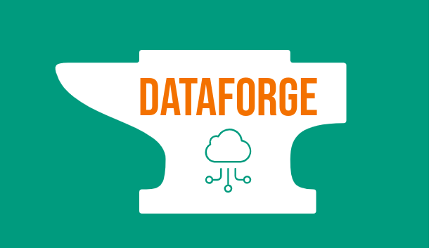

# DataForge

**DataForge** è una piattaforma completa per la gestione e l'elaborazione dei dati, progettata per le piccole e medie imprese (PMI) che desiderano una soluzione semplice e conveniente per la loro infrastruttura di dati. DataForge fornisce strumenti potenti per gestire database, automatizzare flussi di lavoro, e monitorare l'infrastruttura.

## Caratteristiche principali
- **Applicazione Django**: Un'applicazione user-friendly per l'inserimento e la visualizzazione di dati, che permette alle PMI di accedere e manipolare i dati in modo semplice.
- **Database "Silver"**: Un database che memorizza i dati strutturati, pronti per l'analisi preliminare e l'integrazione.
- **Database "Gold"**: Un database avanzato per dati ottimizzati per l'analisi avanzata e il machine learning.
- **Airflow**: Strumenti di automazione per la gestione dei task e la schedulazione dei flussi di lavoro di dati.
- **Monitoraggio e Osservabilità**: Grafana e Prometheus sono integrati per monitorare l'infrastruttura e i cluster Kubernetes, garantendo alta disponibilità e prestazioni ottimali.

## Obiettivo del progetto
DataForge mira a fornire una soluzione economica e scalabile per la gestione dei dati, basata su tecnologie open source e adatta alle esigenze delle PMI. Con un’architettura a microservizi supportata da Kubernetes, la piattaforma può essere facilmente estesa e personalizzata.

## Infrastruttura e Tecnologie Utilizzate
- **Django**: Backend principale per la gestione dei dati e il supporto delle API.
- **PostgreSQL**: Database principale (silver e gold) per la gestione dei dati.
- **Airflow**: Scheduler per orchestrare e automatizzare flussi di dati complessi.
- **Kubernetes**: Per la distribuzione scalabile e la gestione dei container.
- **Helm**: Gestione delle configurazioni Kubernetes e pacchetti.
- **Grafana e Prometheus**: Monitoraggio dell’infrastruttura e visualizzazione delle metriche.

## Come Iniziare
1. Consulta la documentazione [Installation Guide](docs/installation.md) per istruzioni di installazione e setup.
2. Utilizza i workflow CI/CD (vedi `.github/workflows`) per automatizzare i processi di build e deploy.
3. Configura i database e l'applicazione Django come descritto in [Deployment Guide](docs/deployment.md).

## Contribuire
Contributi e feedback sono benvenuti! Consulta [CONTRIBUTING.md](CONTRIBUTING.md) e [CODE_OF_CONDUCT.md](CODE_OF_CONDUCT.md) per maggiori informazioni su come contribuire.

---

