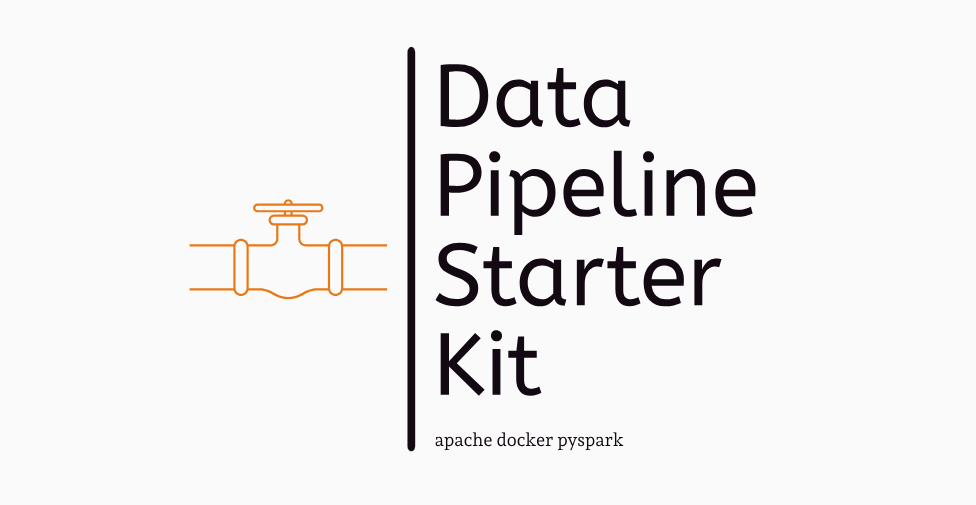

# Airflow-Docker-PySpark Template



## Description

Welcome to the **Airflow-Docker-PySpark Template**. This template is designed to help you quickly create projects that require ETL pipelines using Apache Airflow, Docker, and PySpark. 

## Features

- **Modular Architecture**: Easy to extend and customize.
- **Docker Integration**: Simplifies environment setup with Docker and Docker Compose.
- **Airflow DAGs**: Pre-configured Airflow Directed Acyclic Graphs (DAGs).
- **PySpark Jobs**: Sample PySpark jobs to get you started.
- **Scalability**: Designed to scale with your data processing needs.

## Project Structure

```bash
pipe
├── docker-compose.yaml
├── Dockerfile
├── airflow
│   └── dags
│       └── dag.py
├── config
│   └── airflow.cfg
├── data
│   ├── processed
│   └── raw
├── docs
│   └── README.md
├── requirements.txt
└── scripts
    └── scripts1.py
```


- **airflow/dags/**: Contains Airflow DAGs.
- **scripts/**: Contains the tasks definitions.
- **assets/images/**: Contains images used in the README.

## Prerequisites

Make sure you have the following tools installed on your system:

- Docker
- Docker Compose

## Quick Start

1. Clone this repository to your local system:

    ```sh
    git clone https://github.com/leoBitto/Pipeline_Starter_Kit.git <dir name>
    cd <dir name>
    ```

2. Build and start the Docker containers:

    ```sh
    cd <dir name>
    docker-compose up initi-airflow --build
    docker-compose up --build
    ```

3. Access the Airflow web interface by opening your browser and navigating to `http://localhost:8080`.

## Usage

### Creating a New DAG

1. Create a new Python file in the `airflow/dags/` folder.
2. Define your DAG using the Airflow API.

Example `dags/dag.py`:

```python
from airflow import DAG
from airflow.operators.dummy_operator import DummyOperator
from airflow.operators.python_operator import PythonOperator
from datetime import datetime
from scripts import scripts1

default_args = {
    'owner': 'airflow',
    'depends_on_past': False,
    'start_date': datetime(2024, 6, 20),
    'retries': 1,
}

dag = DAG(
    'read_csv',
    default_args=default_args,
    description='read a csv from a folder',
    schedule_interval='@daily',
)

start = DummyOperator(task_id='start', dag=dag)

task1_operator = PythonOperator(
    task_id='task1',
    python_callable=scripts1.task1,
    dag=dag,
)

start >> task1_operator
```

### Creating a New PySpark Job
import datetime as dt
import numpy as np
import os
from pyspark.sql import SparkSession

```python
def task1():
    spark = SparkSession.builder \
        .appName("example_pyspark_task") \
        .getOrCreate()
    PATH_CSV = '/opt/airflow/data/raw'
    NAME_CSV = 'scontrini922.csv'
    COMPLETE_PATH = os.path.join(PATH_CSV, NAME_CSV)
    print(COMPLETE_PATH)
    # Leggi il file CSV
    df = spark.read.csv(COMPLETE_PATH, header=True, inferSchema=True)
    # Ferma la sessione Spark
    spark.stop()
    print(f"the df has been read: {df}")

```


## Use Cases
- Data Ingestion Pipelines
- ETL Processes
- Data Transformation and Cleaning
- Batch Processing


## Contributing
If you would like to contribute to this project, please fork the repository and submit a pull request with your changes.
